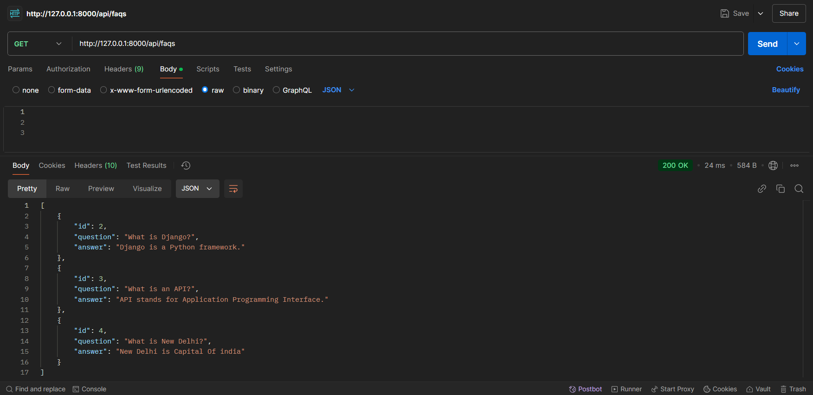
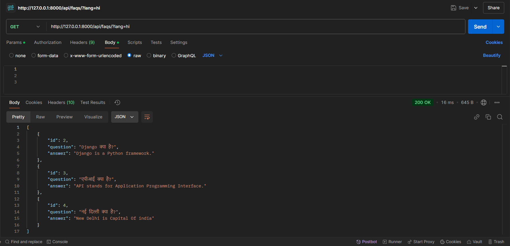
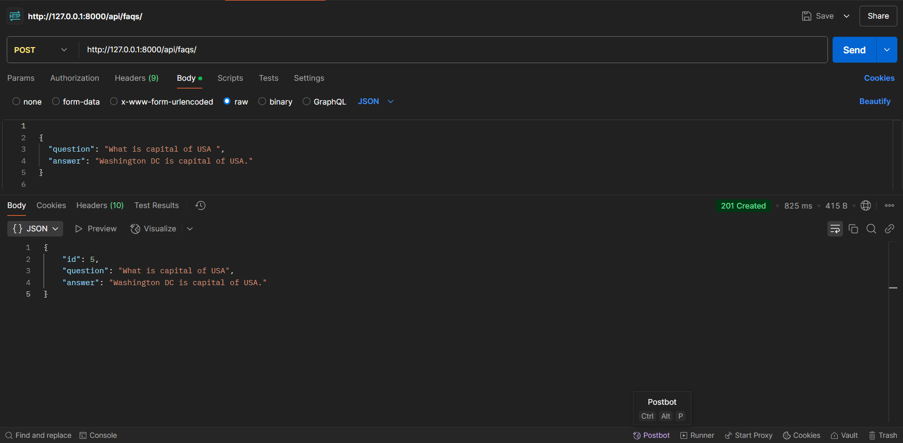
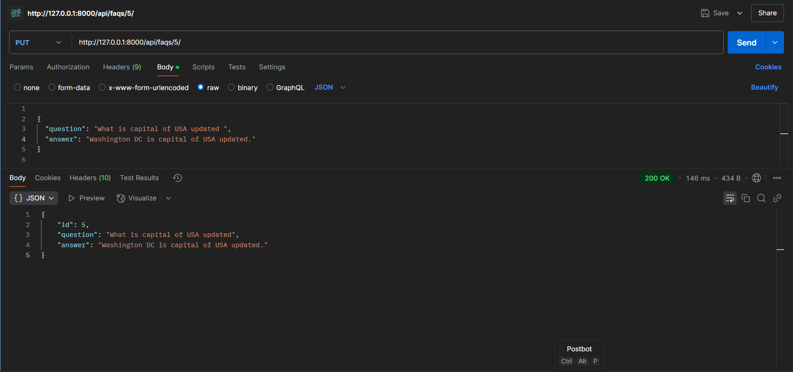
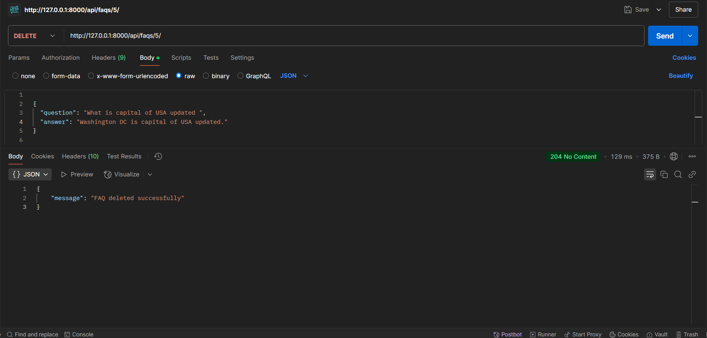

# 📝 FAQ API - Django REST Framework

This is a **Django-based FAQ API** that supports **multilingual translations, WYSIWYG editor, Redis caching**, and a fully functional **REST API**.

## 🚀 Features
- ✅ **Django REST API** to manage FAQs
- 🌍 **Multilingual support** using Google Translate
- ✍ **WYSIWYG Editor** (CKEditor 5) for FAQ answers
- ⚡ **Caching with Redis** for improved performance
- 📝 **Unit tests** for API and models

---

## 🛠 Installation Guide

### **1️⃣ Clone the Repository**
```sh
git clone https://github.com/ritscode04/faq-api.git
cd faq-api
```

### **2️⃣ Create and Activate a Virtual Environment**
```sh
python -m venv venv
source venv/bin/activate  # macOS/Linux
venv\Scripts\activate  # Windows
```

### **3️⃣ Install Dependencies**
```sh
pip install -r requirements.txt
```

### **4️⃣ Apply Migrations & Start Server**
```sh
python manage.py makemigrations
python manage.py migrate
python manage.py runserver
```

### **5️⃣ Access the API**
- API Home: [http://127.0.0.1:8000/](http://127.0.0.1:8000/)
- Fetch FAQs: [http://127.0.0.1:8000/api/faqs/](http://127.0.0.1:8000/api/faqs/)
- Fetch FAQs in Hindi: [http://127.0.0.1:8000/api/faqs/?lang=hi](http://127.0.0.1:8000/api/faqs/?lang=hi)

---

## 🔗 API Endpoints

| Method | Endpoint              | Description                |
|--------|----------------------|----------------------------|
| GET    | `/api/faqs/`         | Get all FAQs               |
| GET    | `/api/faqs/?lang=hi` | Get FAQs in Hindi          |
| POST   | `/api/faqs/`         | Create a new FAQ           |
| PUT    | `/api/faqs/{id}/`    | Update an FAQ              |
| DELETE | `/api/faqs/{id}/`    | Delete an FAQ              |


## 📌 Postman Collection
To test the API in **Postman**, download and import the collection:

📥 **[Download Postman Collection](FAQ_API.postman_collection.json)**

## How to Import the Collection in Postman

- Open Postman.

- Click "Import".

- Select the downloaded file postman_collection.json.

- Click "Import" to load all API endpoints.

- Test the API!

---


## 📌 API Endpoints and Screenshots

### 🟢 GET `/api/faqs/` (Fetch All FAQs)
Fetches all stored FAQs.

**Request in Postman:**


---

### 🟢 GET `/api/faqs/?lang=hi` (Fetch FAQs in Hindi)
Fetches FAQs in Hindi.

**Request in Postman:**


---

### 🟢 POST `/api/faqs/` (Create a New FAQ)
Creates a new FAQ.

**Request in Postman:**


---

### 🟢 PUT `/api/faqs/5/` (Update an Existing FAQ)
Updates an existing FAQ.

**Request in Postman:**


---

### 🟢 DELETE `/api/faqs/5/` (Delete an FAQ)
Deletes an FAQ.

**Request in Postman:**


---


📌 **Example API Call Using Curl:**
```sh
curl http://127.0.0.1:8000/api/faqs/?lang=hi
```


## ✅ Running Unit Tests
Run the following command to execute **all unit tests**:
```sh
python manage.py test
```

---

## 🔧 Technologies Used
- **Backend:** Django, Django REST Framework
- **Database:** SQLite (Default), PostgreSQL (Optional)
- **Caching:** Redis
- **Editor:** CKEditor 5
- **Translation API:** Google Translate

---

## 📌 Contribution Guidelines
1. **Fork the repository**
2. **Create a feature branch**
3. **Make your changes & commit**
4. **Push your branch and create a Pull Request**

---

## 🔗 Author & Contact
Developed by Ritesh Kumar Pandey
📧 Email: `riteshpanday1999@gmail.com`  
🔗 LinkedIn: "https://www.linkedin.com/in/ritesh-pandey04/"
🔗 GitHub: "https://github.com/ritscode04"

---

## 📜 License
This project is licensed under the **MIT License**. See the [LICENSE](LICENSE) file for details.

---


